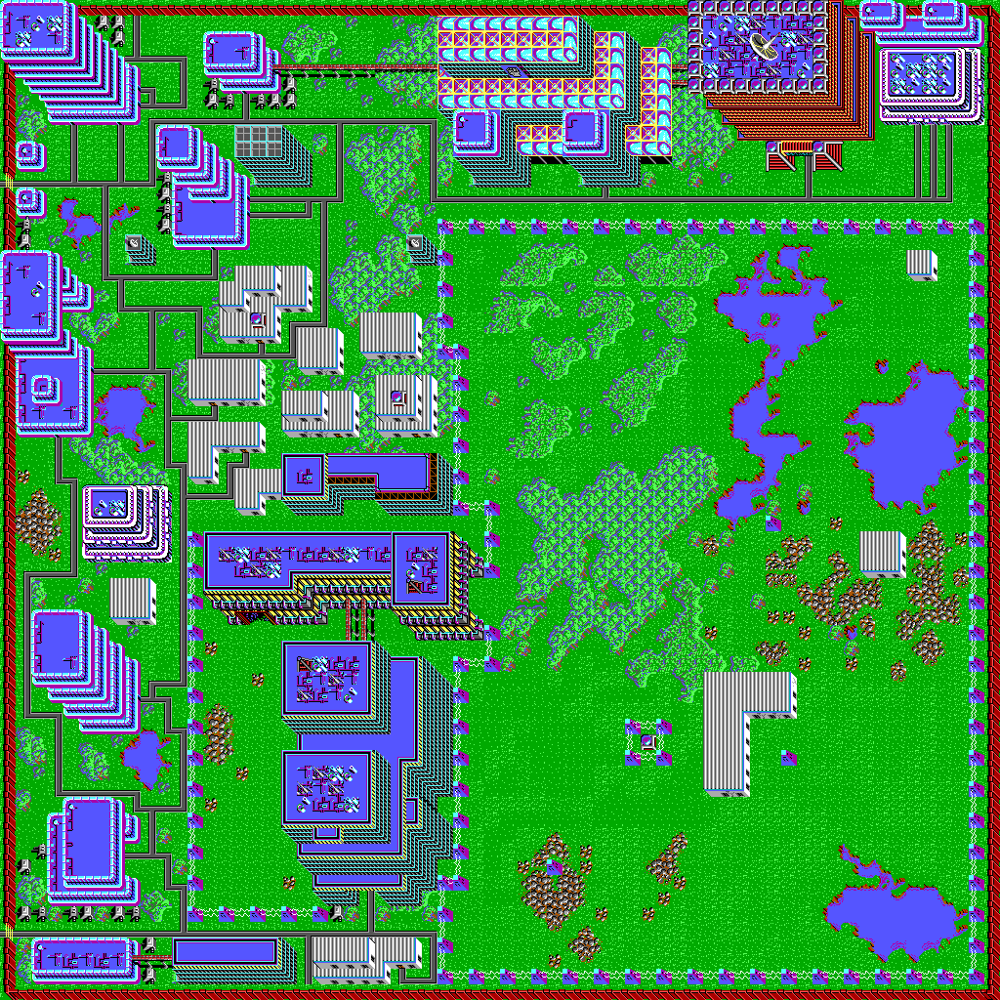

# CrescentHawksTools

This is a .NET CORE toolkit for extracting the assets from the `Crescent Hawks: Inception` game.
Support for `Crescent Hawks: Revenge` will come later.

Currently capable of extracting:
* `.ICN`, `.CMP` Fullscreen graphics
* `.MTP` Map files
* `.CMP` Spritesheets
* `.ICN` Tile Sheets

Remaining assets to extract:
* World map (Stored within EXE, possibly procedural generated?)
* `WWOODBT.SIF` (Need to write converter to WAV)
* Save File Format
* `.BLD` Building files (Needs decompiled code investigation)
* `.ANM` Animation files (Needs decompiled code investigation)

---

To run the current toolkit download the source from Github and compile in Visual Studio.

Running the application will open a console window which will prompt for the directory of your btech installation.

Once enter is pressed the application will extract the files to an Assets folder within the bin folder.

This toolkit is still in deep in development and user interface is a very low priority.
