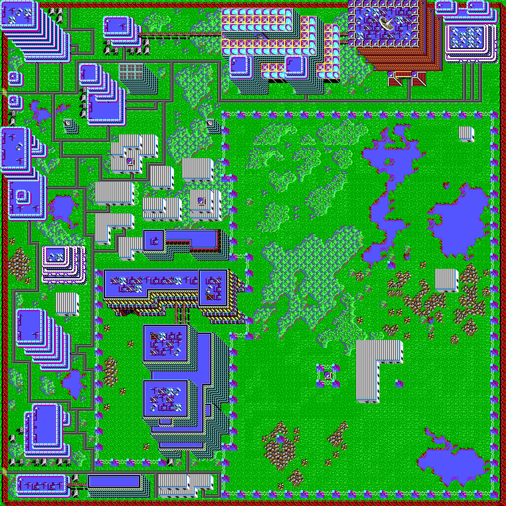
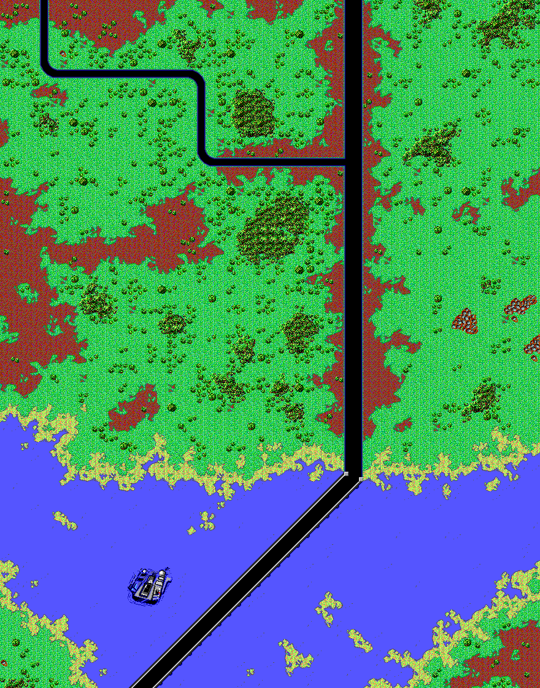
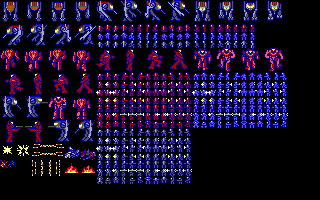

# Crescent Hawks Tools

[](https://github.com/Elthial/CrescentHawksTools/actions/workflows/build.yml)

Crescent Hawks Tools is a dependency-free .NET 8 command-line toolkit for
inspecting, extracting, converting, and safely editing data from legally owned
DOS installations of:

- *BattleTech: The Crescent Hawk's Inception* (1988);
- *BattleTech: The Crescent Hawks' Revenge* (1990).

The repository contains tools and format knowledge, not either game. You must
supply your own original installation. Generated images, audio, reports, and
edited saves stay local and should not be redistributed.

| Inception map export | Revenge scenario-map export |
|:--:|:--:|
|  |  |

<p align="center">
  
</p>

## Toolsets

| Game | Documentation | Highlights |
| --- | --- | --- |
| The Crescent Hawk's Inception | [InceptionTools](docs/INCEPTION.md) | CMP/ICN graphics, MTP maps, ANM animation, BLD scripts, SIF music, PC-speaker effects, saves, characters, BattleMechs, and weapons |
| The Crescent Hawks' Revenge | [RevengeTools](docs/REVENGE.md) | CPS/CMP/ICN graphics, COL palettes, fonts, maps, SCENE scripts, units, weapons, digital/PC-speaker audio, and save analysis/editing |

Both tools use bounded parsers and reject malformed or unsupported input rather
than silently inventing data. JSON and deterministic batch exports are
available where useful for preservation and research.

## Preserved game source

This repository contains the asset tooling, not the reconstructed game source.
For the preservation-oriented C17/SDL3 source ports, see:

- [The Crescent Hawk's Inception SDL port](https://github.com/Elthial/crescent-hawks-inception-sdl-port)
- [The Crescent Hawks' Revenge SDL port](https://github.com/Elthial/crescent-hawks-revenge-sdl-port)

Those projects reconstruct the original DOS program logic while replacing the
lowest-level platform interfaces required to run on modern systems. Original
game assets are not included and must be supplied from a legally owned copy.

## Quick start

Install the [.NET 8 SDK](https://dotnet.microsoft.com/download/dotnet/8.0),
clone this repository, and build both tools:

```powershell
dotnet build CrescentHawksTools.sln --configuration Release
```

Show the command lists:

```powershell
dotnet run --project src/InceptionTools -- help
dotnet run --project src/RevengeTools -- help
```

Point a command at an original installation explicitly:

```powershell
dotnet run --project src/InceptionTools -- inventory --game-dir "D:\Games\BTECH"
dotnet run --project src/RevengeTools -- inventory --game-dir "D:\Games\REVENGE"
```

You may instead set `BTCHI_GAME_DIR` for Inception or `BTCHR_GAME_DIR` for
Revenge. Full command syntax and supported formats are documented in the two
toolset guides above.

Run the asset-independent verification programs:

```powershell
dotnet run --project tests/InceptionTools.Verification
dotnet run --project tests/RevengeTools.Verification
```

On Windows, [`Build.ps1`](Build.ps1) performs restore, Release build, and both
verification passes in one command.

## Repository layout

| Path | Purpose |
| --- | --- |
| `src/InceptionTools` | Inception inspection and extraction CLI |
| `src/RevengeTools` | Revenge inspection and extraction CLI |
| `tests` | Dependency-free verification executables |
| `docs` | Per-game command guides, format notes, and illustrative outputs |
| `.github/workflows` | Public CI build and verification |

Build products (`bin`, `obj`), local game installations, generated extraction
directories, edited saves, and private research captures are ignored.

## Contributing

See [CONTRIBUTING.md](CONTRIBUTING.md). Format claims should be supported by
repeatable evidence, parsers must remain bounded, and uncertain semantics must
be labelled rather than guessed.

## Copyright and licensing

Project-authored source code and documentation are available under the
[MIT License](LICENSE), to the extent contributors hold the relevant rights.
The games, BattleTech setting, names, artwork, audio, text, data, and the small
illustrative exports in `docs/images` remain the property of their respective
rights holders and are not covered by the MIT grant.

Read [NOTICE.md](NOTICE.md) and the [licensing map](LICENSES/README.md) before
redistributing repository material. No license to either original game is
granted. This is an independent preservation project and is not affiliated
with or endorsed by the original developers, publishers, FASA, or current
BattleTech rights holders.
