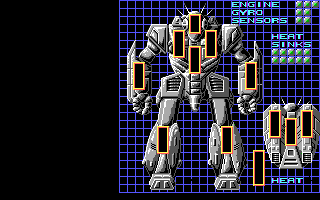

# Inception BattleMech record sheets

Each page is a complete `0x7D`-byte BattleMech record sheet. The stock templates are transcribed from the recovered executable; the Mech-Lube pages apply the exact cumulative mutations performed by the upgrade routine. Sarna links identify the published or game-originated variant designation, while the numerical values remain executable evidence.

The original BattleMech display above is included as the visual key for the location-based data below. The Markdown sheets expose the underlying values which the game presents through that display.

## `0x7D`-byte record layout

| Offset | Size | Field |
| ---: | ---: | --- |
| `0x00` | 16 | Name and status |
| `0x10` | 1 | Tonnage |
| `0x11` | 11 | Current armour |
| `0x1C` | 8 | Current internal structure |
| `0x24` | 2 | Packed current actuator state |
| `0x26` | 1 | Engine heat sinks |
| `0x27` | 10 | Current ammunition by weapon ordinal |
| `0x31` | 1 | Walking movement |
| `0x32` | 1 | Jump movement |
| `0x33` | 35 | Critical and equipment slots |
| `0x56` | 11 | Maximum armour |
| `0x61` | 8 | Maximum internal structure |
| `0x69` | 2 | Packed maximum actuator state |
| `0x6B` | 10 | Maximum ammunition by weapon ordinal |
| `0x75` | 3 | Engine, gyro and sensor hits |
| `0x78` | 1 | Life-support state |
| `0x79` | 2 | Pilot and rider IDs |
| `0x7B` | 1 | Upgrade-package base |
| `0x7C` | 1 | Upgrade-level flags |

Armour order is left arm, left torso, left leg, head, centre torso, right arm, right torso, right leg, rear left torso, rear centre torso and rear right torso. Structure uses the first eight locations. Critical groups are left arm (7), left torso (7), right arm (7), right torso (7), left leg (2), right leg (2), centre torso (2) and head (1).

The **minimum** column on each sheet is the playable lower bound of zero; it is not a second minimum array in the record. Current and maximum columns are stored independently in the original data.

## Stock executable templates

- [Locust - LCT-1V](inception/mechs/Locust%20-%20LCT-1V.md)
- [Wasp - WSP-1A](inception/mechs/Wasp%20-%20WSP-1A.md)
- [Stinger - STG-3R](inception/mechs/Stinger%20-%20STG-3R.md)
- [Commando - COM-2D](inception/mechs/Commando%20-%20COM-2D.md)
- [Chameleon - TRC-4B](inception/mechs/Chameleon%20-%20TRC-4B.md)
- [Jenner - JR7-D](inception/mechs/Jenner%20-%20JR7-D.md)
- [Spectator - Internal Record](inception/mechs/Spectator%20-%20Internal%20Record.md)
- [UrbanMech - UM-R60](inception/mechs/UrbanMech%20-%20UM-R60.md)

## Mech-Lube variants

The second package for each chassis is cumulative: it starts with the first package already installed, and each listed price is charged separately.

| Chassis | First package | Price | Second package | Price |
| --- | --- | ---: | --- | ---: |
| Locust | [LCT-1Y](inception/mechs/Locust%20-%20LCT-1Y.md) | 11,000 | [LCT-1Y2](inception/mechs/Locust%20-%20LCT-1Y2.md) | 15,800 |
| Wasp | [WSP-1Y](inception/mechs/Wasp%20-%20WSP-1Y.md) | 10,400 | [WSP-1Y2](inception/mechs/Wasp%20-%20WSP-1Y2.md) | 14,000 |
| Stinger | [STG-3Y](inception/mechs/Stinger%20-%20STG-3Y.md) | 12,200 | [STG-3Y2](inception/mechs/Stinger%20-%20STG-3Y2.md) | 13,200 |
| Commando | [COM-7Y](inception/mechs/Commando%20-%20COM-7Y.md) | 13,800 | [COM-7Y2](inception/mechs/Commando%20-%20COM-7Y2.md) | 17,600 |
